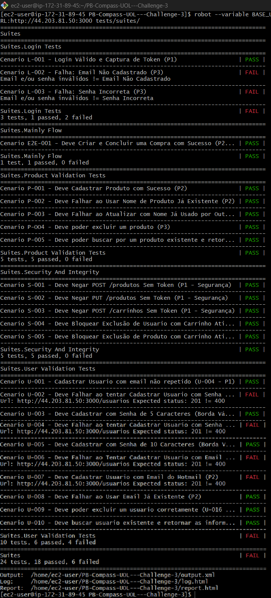
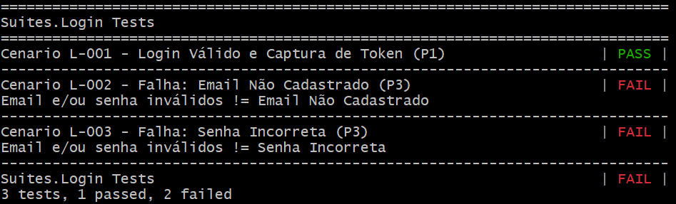
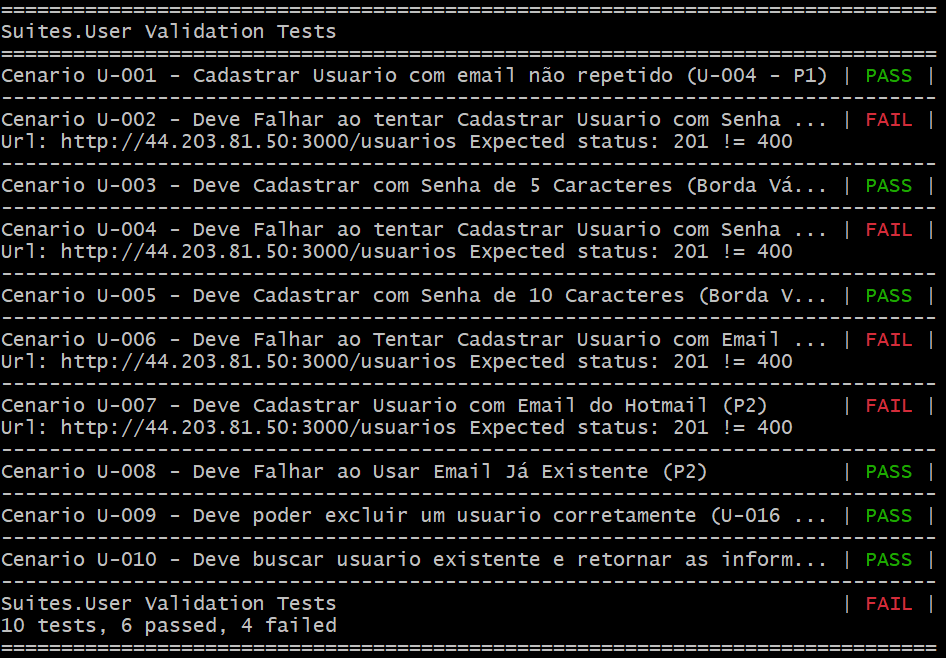

# Challenge QA - Automação da API ServeRest

Este repositório documenta a estratégia, os planos de teste e a automação de ponta a ponta desenvolvida para o **Challenge de QA da API ServeRest**, com foco em testes de regressão, segurança e validação de regras de negócio complexas.

## Rastreabilidade e Gestão do Projeto

Todo o planejamento, execução e rastreamento de defeitos do projeto estão vinculados ao Jira.

| Item | Status / Localização |
| :--- | :--- |
| **Plano de Testes** | Completo e atualizado (matriz de testes P1/P2/P3/P4). |
| **Jira Board** | **[Acesse o Quadro de Tarefas OPS](https://challenge1andressa.atlassian.net/jira/software/projects/OPS/boards/1?atlOrigin=eyJpIjoiNzMxZTFjODVmODZiNGU4YzllYzI5MDhiOGJmMWFiNTYiLCJwIjoiaiJ9)** |

## Tecnologias Utilizadas


---


## Estratégia e Cobertura

O plano de testes foi refinado para garantir o isolamento total dos cenários e cobrir os pontos mais críticos da API:

  * **Validação de Dados:** Reforço na **Análise de Valor Limite (Borda)** para senhas (4, 5, 10, 11 caracteres) e regras de domínio de e-mail (Mitiga Issues 1 e 2).
  * **Segurança (P1):** Teste de todas as rotas de Produto e Carrinho sem autenticação (token).
  * **Integridade:** Testes de **Bloqueio de Exclusão** que impedem a remoção de Usuários ou Produtos vinculados a Carrinhos ativos.
  * **Fluxo Crítico E2E:** Automação do fluxo completo de **Criação e Conclusão de Compra** (P2) para validar a transação de negócio.

## Atividade Extra: Infraestrutura AWS

A automação foi executada em um ambiente de nuvem distribuído, simulando um ambiente de testes real:

1.  **EC2 \#1 (Aplicação):** Instância Linux rodando o Servidor ServeRest (Alvo dos testes).
2.  **EC2 \#2 (Executor Robot):** Instância Linux separada, usada para hospedar o código do Robot Framework e executar os testes de forma remota, validando a conectividade de rede na porta 3000.



## Como Executar os Testes

Para rodar a suíte de testes (após subir as instâncias EC2), siga estes passos no terminal da Máquina Executor Robot (EC2 \#2).

### 1\. Pré-requisitos (No Executor Robot)

```bash
# Navegue para o diretório do projeto e instale as dependências
cd [nome-do-seu-repositorio]
pip3 install -r requirements.txt
```

### 2\. Comando de Execução (Remoto)

Você deve injetar a `BASE_URL` com o **IP Público da sua Máquina ServeRest (EC2 \#1)**.

```bash
# Substitua [IP_PUBLICO_SERVEREST] pelo IP da Máquina #1
robot --variable BASE_URL:http://[IP_PUBLICO_SERVEREST]:3000 tests/suites/
```

### 3\. Resultados

O Robot Framework gerará os relatórios: `report.html` e `log.html`, que provaram o seguinte resultado final:

  * **22 PASSES:** Testes de Segurança (Token), Integridade de Dados e Fluxos E2E.
  * **6 FAILS:** Testes de qualidade que expuseram a falha da API em validar a senha/e-mail (Issues 1 e 2) e em padronizar as mensagens de erro.

  
  
  

## Autora  

**Andressa Von Ahnt**  

🔗 [LinkedIn](https://www.linkedin.com/in/andressa-von-ahnt-831556363) | 📧 andressavahnt@gmail.com  

---